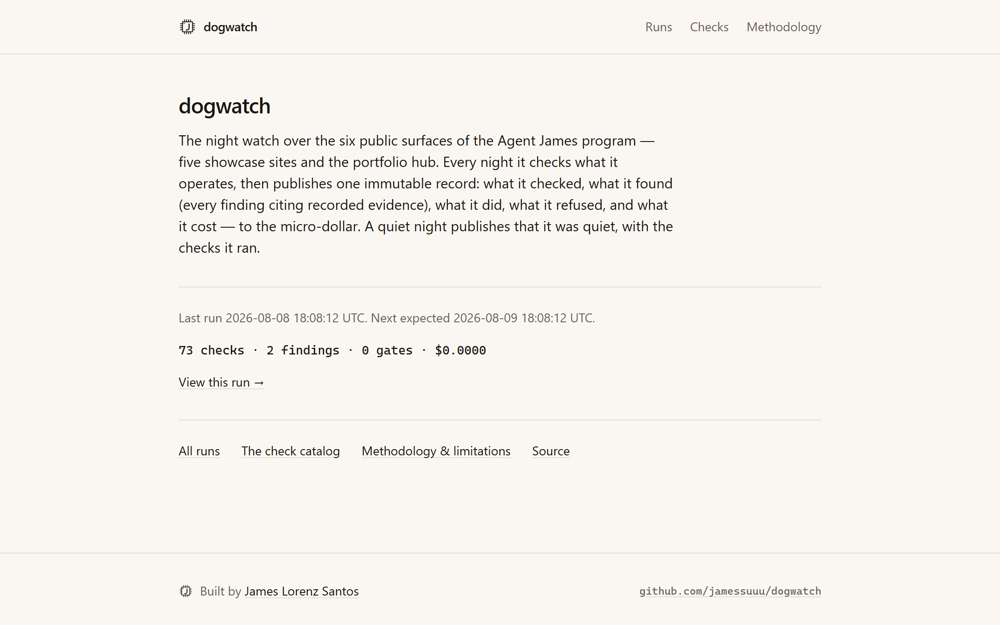
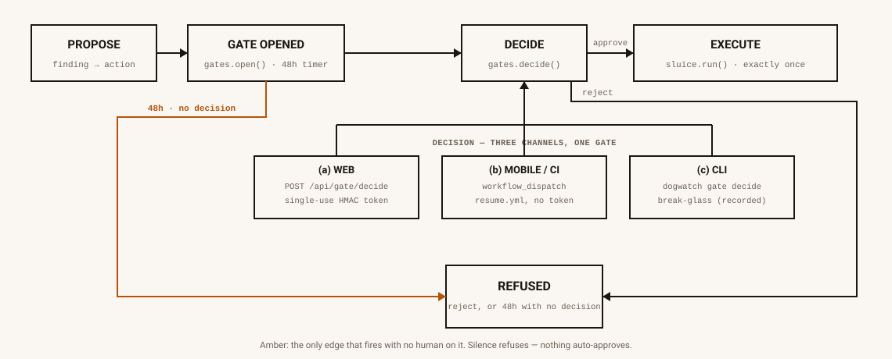

<p align="left">
  
</p>

# dogwatch

**The night watch over the six public surfaces of the Agent James showcase program.
Every night it publishes one immutable record: what it checked, what it found —
every finding citing recorded evidence — what it did, what it refused, and what
it cost to the micro-dollar. A quiet night publishes that it was quiet, with the
checks it ran.**

> **Status: M0–M6 landed.** Workspace, TS strict, ESLint 9, Vitest 4, the
> full `reach`/`header`/`brand`/`link`/`weight` check pack, the R1–R15
> honesty rubric with exact error codes, planted-violation fixtures,
> byte-identical replay goldens, the advisory LLM (Haiku 4.5, forced tool
> schema, Zod-validated, capped, always-degradable — no live call has ever
> been made from this build), Neon + the cross-run Postgres audit chain
> (M4, `src/store`), the human-gate action machinery — propose →
> `gates.open` → notify → three decision channels → `/api/gate/decide` →
> exactly-once execute → hash-linked amendment (M5, `src/effects`) — and
> the site (`apps/web`, statically prerendered from committed JSON, a
> browser Verify button that re-derives findings and re-checks the audit
> hash chain with zero server, M6) are all built and gated on real
> Playwright e2e, not a stub. `draft()`, the issue-drafter half of M3's
> advisory LLM, is fully wired but still provably unreachable — M5's real
> gate notifications use a deterministic template (`templateDraft`), never
> the LLM path (`src/llm/unreachable.test.ts` statically enforces this).
> `artifact`/`repo`/`pkg` remain registered-but-not-implemented check
> families — [`src/checks/registry.ts`](packages/dogwatch/src/checks/registry.ts)
> names the exact reason each is missing (a real GitHub/npm token, a
> deployed sibling to poll).
>
> `runs/` holds real published records (below) — every one of them from a
> local `dogwatch watch` invocation. **`.github/workflows/watch.yml` and
> `canary.yml` are committed (SPEC §5's table) but have never executed** —
> nothing has been pushed to trigger a scheduled run yet, so no autonomous
> night has happened. `cli/trigger.ts`'s `resolveRunKind()` reads
> `GITHUB_EVENT_NAME`, so a real cron firing of `watch.yml` is the only
> thing that will ever produce `kind:"scheduled"`; every record published so
> far honestly carries `kind:"manual"`, because every one of them was. What
> remains is M7: 30 consecutive published nights, a README numbers block
> (runs, quiet nights, findings, gates, refusals, total spend), and the
> portfolio entry — none of which can start until `watch.yml` actually runs
> on its own schedule.
> **This is an operated instance, not a product you install.** Nothing here is
> published to npm; forking and pointing it at your own surfaces is
> unsupported. [`docs/OPERATIONS.md`](docs/OPERATIONS.md) documents what M5
> needs an operator to know (the `/api/gate/decide` protections,
> `resume.yml` polling economics, secrets inventory); the fuller M6
> fork-and-operate pass is still outstanding — OPERATIONS.md's own scope
> note says as much ("grows additively, never rewritten").
> [`docs/SPEC.md`](docs/SPEC.md) is the complete, binding design document.
> The site is live at **[dogwatch-two.vercel.app](https://dogwatch-two.vercel.app)**.

## The record so far

Two runs published as of this commit, both `kind:"manual"` for the reason above:
one quiet, one with 2 low-severity findings (two outbound links dogwatch
couldn't verify — one returned 403, the other a nonsense 999 status), 0 gates
opened, **$0.0000** total spend.
Small numbers, honestly reported — this is what a two-site-live program looks
like before `watch.yml` has ever fired. [Every run, in full →](https://dogwatch-two.vercel.app/runs)

## Watch it work

<p>
  <a href="https://dogwatch-two.vercel.app/runs">
    
  </a>
</p>

That frame is a poster, not a video — GitHub doesn't autoplay one. The real
recording (scripted [Playwright](scripts/record-demo.mjs) against the live
site, not a screencast) autoplays on [the homepage](https://dogwatch-two.vercel.app)
and is downloadable directly at
[`apps/web/public/demo/dogwatch-demo.webm`](apps/web/public/demo/dogwatch-demo.webm).
It opens `/runs`, opens the newest run, and scrolls its checks, findings, and
cost — no narration, no cuts.

The mechanism worth seeing is the gate itself — propose, open, decide through
one of three channels, execute exactly once — with the 48-hour timeout into
`REFUSED` as the one amber edge, because fail-closed is the whole argument:

<p>
  
</p>

Generated by [`scripts/diagram.mjs`](scripts/diagram.mjs), CI drift-checked
(`pnpm diagram:check`) exactly like the brand assets — this image cannot
silently outpace the code it draws.

## Autonomy ladder, in brief

**L2 auto** — everything inside this repo. **L3 human gate** — every write to
a repo dogwatch does not own; three decision channels (web token, GitHub
mobile via `workflow_dispatch`, CLI break-glass), 48-hour fail-closed timeout,
no auto-approve anywhere. Full ladder and the honesty rubric in prose:
[the live `/docs`](https://dogwatch-two.vercel.app/docs).

## What it watches

The five sibling showcase sites (tiltmeter, chaff, sluice, snapgauge, dogwatch —
**not yet deployed**, so every check for them publishes `skipped:not_published`
before any request is made, never a response-driven guess) plus the live
[agentjames.vercel.app](https://agentjames.vercel.app), declared once in
[`targets.json`](targets.json) — config, not code, hashed into every record so a
change is visible in the next run's diff.

**dogwatch watches six surfaces I operate and makes no claim about anyone else's
software.** A finding is a statement about one request dogwatch made
(`GET https://… → 503 at 2026-08-08T15:02:11Z`), never about a vendor's state.
Finding text is generated by a rule's template from recorded evidence and CI
re-derives it (R13) — a model or a human cannot author a finding; the type
system has no free-text path that produces one.

| Family | Landed | Asserts |
|---|---|---|
| `reach` | M1 | `/` reachable, final URL + redirect chain unchanged |
| `header` | M2 | declared security/policy headers present, value drift vs. the previous record |
| `brand` | M2 | footer backlink to agentjames + chip-mark favicon reachable |
| `link` | M2 | bounded same-origin crawl (≤30 pages), external links HEAD-checked (≤60) |
| `weight` | M2 | transfer bytes of `/` vs. a declared budget |
| `watch` | M4 | dogwatch on itself — `watch.chain_gap` compares the store's actual audit-chain head against what git published last night |
| `artifact` / `repo` / `pkg` | M4 (still not implemented) | registered in [`src/checks/registry.ts`](packages/dogwatch/src/checks/registry.ts) with the exact reason each isn't built yet — a deployed sibling to poll, a scoped GitHub token, and a real `npm i` smoke step, respectively |

Timings and download counts are **metrics**, recorded and rendered, never
judged and never a finding (R14) — a number moving is not an event.

## The honesty rubric (`dogwatch verify`)

`docs/SPEC.md` §7 defines fifteen rules, each with an exact machine-checkable
error code — no rule may pass a violation with a warning. `dogwatch verify --all
--rerun-rules` runs on every push:

| # | Catches | Code |
|---|---|---|
| R1 | empty `checks[]`, a check stuck non-terminal | `E_NO_CHECKS`, `E_CHECK_NONTERMINAL` |
| R2 / R3 | a finding on a non-finding check, a finding-verdict check with no finding | `E_ORPHAN_FINDING`, `E_UNREPORTED_CHECK` |
| R4 | a finding without a real, in-window, resolvable source | `E_UNSOURCED_FINDING` |
| R5 | a quiet run whose absence-of-evidence section doesn't add up | `E_NO_ABSENCE_SECTION` |
| R6 | a skip/error with no machine reason, or missing from `notChecked` | `E_SILENT_SKIP` |
| R7 / R8 | an action or gate not backed by real audit events | `E_ACTION_UNBACKED`, `E_GATE_UNBACKED` |
| R9 | cost that doesn't sum, or LLM usage claimed without provider data | `E_COST_UNBACKED` |
| R10 | an advisory note with no model call behind it, or citing what isn't there | `E_ADVISORY_UNGROUNDED` |
| R11 | a broken or unverified sluice audit hash chain | `E_CHAIN_BROKEN` |
| R12 | a record whose content doesn't match its own committed hash | `E_RECORD_TAMPERED` |
| R13 | **a finding whose statement wasn't re-derived byte-for-byte from stored evidence** | `E_MANUFACTURED_FINDING` |
| R14 | a metric wearing a severity — metrics are never findings | `E_METRIC_AS_FINDING` |
| R15 | a secret-shaped string, or a non-allowlisted header, anywhere in a published record | `E_SECRET_LEAK` |

[`fixtures/violations/`](fixtures/violations) plants one broken record per rule
(16 fixtures — R1 has two distinct failure codes) and asserts the exact code;
[`fixtures/records/`](fixtures/records) holds two replay goldens (`quiet.json`,
`findings.json`) that a frozen-clock, seeded-id replay of
[`fixtures/transcripts/`](fixtures/transcripts) must reproduce byte-for-byte —
`evals/*.eval.test.ts`, zero tolerance, both gate CI.

R11's chain check calls `@jamessuuu/sluice`'s own `verifyEvents` — sluice's
primitive, not a re-derived copy of it (SPEC non-goal: no sluice
reimplementation). The same isomorphic function runs offline here, in CI, and
(landed at M6) inside a visitor's browser via the `/runs/<id>` Verify button,
with zero server.

## Non-goals

No third-party surfaces — only what James operates. No content generation — the
only model-authored text (M3) is one labelled advisory paragraph on an eventful
night and one human-approved issue draft. No reimplementation of sibling logic
(model drift is tiltmeter's, MCP contract drift is snapgauge's) or of sluice's
retry/gate/audit primitives. No npm package. No uptime SLA, no paging, no
synthetic performance score — one request, one runner, one region, once a
night. No secret in any published artifact, ever.

## The published record

`runs/<YYYY>/<YYYY-MM-DD>-<runId>.json`, canonical JSON (sorted keys, 2-space,
LF, trailing newline), schema at
[`schemas/run-record.v1.json`](schemas/run-record.v1.json) — generated from the
Zod source of truth ([`src/record/schema.ts`](packages/dogwatch/src/record/schema.ts))
and CI drift-checked. Every check carries a `curl` reproduction line; every
finding carries ≥1 source (URL, method, status, retrieval timestamp, and a path
that resolves inside the same record); a quiet run still publishes an
`absenceOfEvidence` section naming what it checked.

The product's state is the committed artifact, not a database: baselines
(previous headers, redirect chains) are read from the previous published record
in git, not from a store. `runs/index.json` and `state/pending-gates.json` are
regenerated by `dogwatch render` and CI drift-checks the output.

[Read a record field by field →](https://dogwatch-two.vercel.app/docs#reading-a-record)

## Limitations

This is an operated instance, not a product you install — nothing here is
published to npm, and forking this repo to point it at your own surfaces is
unsupported. dogwatch watches six surfaces I operate and makes no claim about
anyone else's software. One request, one runner, one region, once a night —
not an uptime claim; no SLA, no paging, no synthetic performance score.
Timings and download counts are metrics: recorded and rendered, never judged,
never a finding. `artifact`, `repo`, and `pkg` are registered check families
that aren't implemented yet — [`src/checks/registry.ts`](packages/dogwatch/src/checks/registry.ts)
names the exact reason each is missing. The full failure-mode contracts (Neon
down, a killed runner, a stolen token, a gate never decided) are at
[`docs/SPEC.md` §9](docs/SPEC.md#9-failure-contracts-the-ugly-paths) and in
prose at [the live `/docs`](https://dogwatch-two.vercel.app/docs#failure-modes).

## CLI

```
dogwatch watch [--dry-run] [--only <family>] [--targets <file>]   the full run
dogwatch render [--check]                                          regenerate runs/index.json + state/pending-gates.json
dogwatch verify <record…|--all> [--rerun-rules] [--offline]        the rubric validator
dogwatch resume                                                    sweep timeouts, claim decided gates, execute exactly once, amend (M5)
dogwatch gate ls|show <id>|decide <id> <approve|reject>             operator break-glass for gates — decide is decision channel (c) (M5)
```

Exit codes: `0` clean · `1` findings at/above the gate · `2` probe/environment
failure · `3` rubric violation in a record · `4` usage/config error · `5`
internal — 1 and 3 are deliberate: a different owner fixes each.
`resume`/`gate` are registered the same as every other command
([`src/cli/index.ts`](packages/dogwatch/src/cli/index.ts)) — landed with the
gate kernel at M5, not stubs.

## Monorepo

| Path | Purpose |
|---|---|
| `packages/dogwatch` | **Private, never published** — bin `dogwatch`. `src/checks` (pure rules) · `src/probe` (the only network code) · `src/record` (builder, canonical JSON, hashing) · `src/verify` (the rubric, browser-safe) · `src/llm` (advisory triage, landed M3) · `src/store` (Neon/`sluice-store-postgres` wiring + the `dogwatch_budget` table, landed M4) · `src/effects` (gate/action wiring, landed M5) · `src/cli` |
| `packages/dogwatch/src/effects` | Propose → `gates.open` → notify → three decision channels → exactly-once execute → hash-linked amendment — landed M5 |
| `packages/dogwatch/src/llm` | Advisory triage (`triage`, landed M3) + issue drafting (`draft`, fully wired but still provably unreachable — M5's real gate notifications use a deterministic template instead) |
| `apps/web` | Next.js 16 App Router, React 19 — landed at M6, `/gate` (the decision page) added with M5. Every page prerendered from committed JSON except the one write path this product will ever have, `/api/gate/decide` (M5, the only route handler); the `/runs/<id>` Verify button imports `packages/dogwatch`'s compiled `verify`/`checks`/`record` output plus `@jamessuuu/sluice`'s `verifyEvents` straight into the browser bundle |

`src/checks` and `src/verify` never import a `node:*` builtin — enforced by an
ESLint boundary rule — which is what lets a published record be re-derived and
re-verified inside a browser with zero server (M6). `src/probe` is the only
network code in the whole pipeline and is injected everywhere else, so the full
pipeline replays offline from a recorded transcript.

## Dependency on sluice

`@jamessuuu/sluice` and `@jamessuuu/sluice-store-postgres` are both linked as
an unpublished sibling repo (`link:../sluice/packages/*` — SPEC's own
sequencing note). M0–M6 are all built against that sibling checkout, `MemoryStore`
in tests and the browser verifier, `sluice-store-postgres` in production —
M4/M5 did **not** wait for sluice to tag `1.0.0-rc.1`, they landed the same
way M0–M3 did, against the sibling link. This becomes a pinned npm version
range once sluice publishes; until then, CI checks the sibling repo out next
to this one on every run so the link resolves the same way it does on a
local clone with both repos checked out side by side. Every probe runs
inside `sluice.run()` with `circuitKey = host`; the audit trail in every
record's `audit` block, and its hash-chain verification, are sluice's, not
dogwatch's own.

## Cost

Every published `cost.microUsd` is computed in integer micro-USD from
provider-reported usage × `pricing.<date>.json` — never a constant
(`src/llm/cost.ts`). A quiet night still costs exactly `$0.0000`,
`llm: { calls: 0, reason: "no_findings" }`. On a findings night, one
advisory Haiku 4.5 call is attempted only if `ANTHROPIC_API_KEY` is
configured (never true in this build or its tests — see `src/llm/README.md`)
and the daily budget (`dogwatch_budget`, 20 calls / 100k in / 20k out /
$0.20) hasn't tripped; every other case degrades honestly
(`degraded: [{component:"llm", reason:...}]`) rather than silently skipping
or crashing. With `DATABASE_URL` configured, the budget counter is Neon-backed
and durable across processes (M4's `PostgresBudgetStore`) rather than
per-run; unconfigured, it stays the honest in-memory M0–M3 default. Non-token
infrastructure (GitHub Actions minutes) is asserted "$0.00 billed, not $0.00
consumed" — `watch.yml`/`canary.yml` are committed but, per the Status block
above, have never actually run, so this line is a documented intent, not yet
a measured fact.

## The site (`apps/web`)

Next.js 16 App Router, React 19, TS strict + `noUncheckedIndexedAccess`,
Tailwind 4 (config in `app/globals.css`'s `@theme`, no `tailwind.config.js`).
Every page is prerendered at build time from committed JSON — `/`, `/runs`,
`/runs/<id>`, `/checks` (the same registry the runner reads), `/methodology`,
and `/docs` (what dogwatch is and isn't, a run record field by field, the
gate flow, the rubric in prose, cost accounting, and every failure mode).
`/gate` (M5) is the one dynamic page — it POSTs a human's
decision to the one write path this product will ever have:
`/api/gate/decide` (`apps/web/app/api/gate/decide`), this build's **only
route handler**.

`/runs/<id>`'s **Verify** button runs entirely in the browser: it imports
`packages/dogwatch`'s compiled `verify`/`checks`/`record` modules (browser-
bundled from `packages/dogwatch/dist`, built by `pnpm --filter dogwatch
build` before the site builds — its `exports` field points `tsc` at raw
source, so the site consumes the same build output any other npm consumer
would) plus `@jamessuuu/sluice`'s own `verifyEvents`, re-derives every
finding from the record's own stored evidence, and re-checks the audit hash
chain — zero server, the exact same code CI already runs offline. A
Playwright suite (`apps/web/e2e/smoke.spec.ts`) asserts it turns green on a
real record and red on a planted rubric-violation fixture
(`fixtures/violations/`), that `/` renders with JavaScript disabled, and
that the footer + favicon appear on every page.

## License

MIT — see [LICENSE](LICENSE). Brand assets (`apps/web/public/brand/`) are
© James Lorenz Santos, all rights reserved, and are **not** covered by the code
license; they identify the author and may not be reused to identify other
projects or persons.

---

Part of the [Agent James](https://agentjames.vercel.app) portfolio. Siblings:
[sluice](https://github.com/jamessuuu/sluice) ·
[snapgauge](https://github.com/jamessuuu/snapgauge) ·
[chaff](https://github.com/jamessuuu/chaff) ·
[tiltmeter](https://github.com/jamessuuu/tiltmeter).
